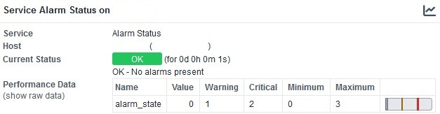
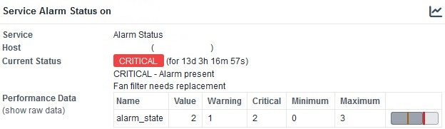

# check_adva_alarms

A simple Nagios Plugin to monitor the alarms of ADVA WDM systems.


### Description

This script extracts the alarm description via SNMPv2.


### Dependencies

- Python 3
- OMD, Check_MK or other Monitoring solutions
- SNMPv2 enabled on your ADVA WDM system


### Tested on the following systems

- OMD 5.0 (Ubuntu 22) with Python 3.10
- ADVA FSP 3000 C (SW: 3.3.1)


### Installation

Copying it to your local plugin folder should be enough


### Usage

python3 check_adva_alarms.py HOSTNAME SNMPv2-COMMUNITY


### OMD command and service definition

The command and service definitions for OMD should look something like this:

````
define command {
  command_name                   check_adva_alarms
  command_line                   python3 $USER5$/check_adva_alarms.py $HOSTADDRESS$ $ARG1$
}

define service {
  service_description            Alarm Status
  host_name                      hostname_wdm
  use                            service-template-interval-5min
  check_command                  check_adva_alarms!MySecretSnmpCommunity
}
````


### Output






### License

This project is licensed under the GNU General Public License v3.0 License - see the LICENSE.md file for details
